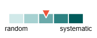

# Handling Missing Time Series Data

<style>
    table tr td {
        vertical-align: middle;
        position: relative;
    }
    table tr td p {
        display: inline-block;
        vertical-align: middle;
    }
    table th {
        text-align: center !important;
    }
    .center {
        text-align: center;
    }
    .justify {
        display: flex;
        justify-content: space-between;
        align-items: center;
    }
    .green {
        background-color: rgba(144, 238, 144, 0.2);
    }
    .red {
        background-color: rgba(255, 99, 71, 0.2);
    }
</style>


## Introduction

Missing data is an almost universal challenge in real-world Data Science, yet its impact is particularly acute in the context of time series analysis. In a temporal sequence, every observation is bound to its neighbours; meaning a single gap can disrupt seasonal patterns, invalidate trend calculations, and degrade the performance of forecasting models. Simply ignoring these gaps or applying a one-size-fits-all solution often introduces systematic bias that can skew entire business decisions.

This guide provides a structured framework for navigating the complexities of missingness. We begin by diagnosing the underlying mechanisms categorising data loss (such as 'Missing Completely at Random', 'Missing at Random', and 'Missing Not at Random'), before exploring the fundamental difference between interpolating within known bounds and extrapolating into the unknown. We then move beyond theory to demonstrate a wide range of practical handling techniques, from basic statistical imputation to sophisticated machine learning models, ensuring you have the right strategy for every scenario.


## **Part 1:** Causes / Reasons

There are many reasons why data can be missing in a time series data set. Understanding the underlying causes of missing data is crucial for selecting appropriate handling techniques and ensuring the integrity of your analysis.

Here are some common reasons for missing data in time series:

| Reason          | Comment                                                                                     |            Score            |
| --------------- | ------------------------------------------------------------------------------------------- | :-------------------------: |
| Sensor failure  | Data could not be retrieved or kept                                                         |  |
| Not applicable  | If not children, there is no age of your children                                           |  |
| Publication lag | Sydney market volumes always come 3 months delayed because of complicated gathering process |  |
| Drop in/out     | Categories (dis)appeared at some point in time                                              |  |
| Label change    | Split of a category in to two                                                               |  |
| Intentional     | Intentionally filtered outlier (wrong data suspect)                                         |  |
| Refusal         | Optional data not provided or refused to answer                                             |  |
| Table joins     | Missing data is generated by table joins in SQL                                             |  |


### Missing Completely at Random (MCAR)

Mechanisms/examples:

- Reporting lag of last 3 months
- Our pipeline crashed because of unrelated reasons

<table>
    <tr>
        <td>
            <div class="center"><b>Source</b></div>
            <table>
                <tr><th>t</th><th>y</th><th>x1</th><th>x2</th></tr>
                <tr><td>2023-01-01</td><td>9.8</td><td>18.2</td><td>1.2</td></tr>
                <tr><td>2023-01-02</td><td>10.3</td><td>18.6</td><td>2.3</td></tr>
                <tr><td>2023-01-03</td><td>24.6</td><td>49.2</td><td>0.5</td></tr>
                <tr><td>2023-01-04</td><td>7.5</td><td>14.4</td><td>0.7</td></tr>
                <tr><td>2023-01-05</td><td>11.1</td><td>20.1</td><td>1.7</td></tr>
                <tr><td>2023-01-06</td><td>10.0</td><td>18.9</td><td>1.1</td></tr>
                <tr><td>2023-01-07</td><td>9.9</td><td>19.1</td><td>0.8</td></tr>
                <tr><td>2023-01-08</td><td>8.7</td><td>16.4</td><td>0.8</td></tr>
                <tr><td>2023-01-09</td><td>10.6</td><td>20.1</td><td>0.9</td></tr>
                <tr><td>2023-01-10</td><td>11.4</td><td>21.9</td><td>1.0</td></tr>
            </table>
        </td>
        <td>
            <div class="center"><br><br>Completely<br>random<br>➡️</div>
        </td>
        <td>
            <div class="center"><b>Result</b></div>
            <table>
                <tr><th>t</th><th>y</th><th>x1</th><th>x2</th></tr>
                <tr><td>2023-01-01</td><td>9.8</td><td>18.2</td><td>1.2</td></tr>
                <tr><td>2023-01-02</td><td>10.3</td><td>18.6</td><td>&nbsp;</td></tr>
                <tr><td>&nbsp;</td><td>&nbsp;</td><td>&nbsp;</td><td>&nbsp;</td></tr>
                <tr><td>2023-01-04</td><td>&nbsp;</td><td>14.4</td><td>0.7</td></tr>
                <tr><td>2023-01-05</td><td>11.1</td><td>20.1</td><td>1.7</td></tr>
                <tr><td>2023-01-06</td><td>10.0</td><td>18.9</td><td>1.1</td></tr>
                <tr><td>2023-01-07</td><td>9.9</td><td>&nbsp;</td><td>0.8</td></tr>
                <tr><td>2023-01-08</td><td>8.7</td><td>16.4</td><td>0.8</td></tr>
                <tr><td>2023-01-09</td><td>&nbsp;</td><td>20.1</td><td>0.9</td></tr>
                <tr><td>2023-01-10</td><td>11.4</td><td>21.9</td><td>1.0</td></tr>
            </table>
        </td>
    </tr>
</table>


### Missing at Random (MAR)

Mechanisms/examples:

- Airlines have a different level of 'completeness' of flight event data
- Older trucks are not yet all equipped with GPS sensors (correlation with capacity, CO2 emissions, etc)
- Shipment not detected as arrived because truck GPS did not hit the geofence properly (location specific problem)

<table>
    <tr>
        <td>
            <div class="center"><b>Source</b></div>
            <table>
                <tr><th>t</th><th>y</th><th>x1</th><th>x2</th></tr>
                <tr><td>2023-01-01</td><td>9.8</td><td>18.2</td><td>1.2</td></tr>
                <tr><td>2023-01-02</td><td>10.3</td><td>18.6</td><td>2.3</td></tr>
                <tr><td>2023-01-03</td><td>24.6</td><td>49.2</td><td>0.5</td></tr>
                <tr><td>2023-01-04</td><td>7.5</td><td>14.4</td><td>0.7</td></tr>
                <tr><td>2023-01-05</td><td>11.1</td><td>20.1</td><td>1.7</td></tr>
                <tr><td>2023-01-06</td><td>10.0</td><td>18.9</td><td>1.1</td></tr>
                <tr><td>2023-01-07</td><td>9.9</td><td>19.1</td><td>0.8</td></tr>
                <tr><td>2023-01-08</td><td>8.7</td><td>16.4</td><td>0.8</td></tr>
                <tr><td>2023-01-09</td><td>10.6</td><td>20.1</td><td>0.9</td></tr>
                <tr><td>2023-01-10</td><td>11.4</td><td>21.9</td><td>1.0</td></tr>
            </table>
        </td>
        <td>
            <div class="center"><br><br>y-values above<br>10.0 have a 50%<br>chance of not<br>being reported<br>➡️</div>
        </td>
        <td>
            <div class="center"><b>Result</b></div>
            <table>
                <tr><th>t</th><th>y</th><th>x1</th><th>x2</th></tr>
                <tr><td>2023-01-01</td><td>9.8</td><td>18.2</td><td>1.2</td></tr>
                <tr><td>&nbsp;</td><td>&nbsp;</td><td>&nbsp;</td><td>&nbsp;</td></tr>
                <tr><td>2023-01-03</td><td>24.6</td><td>49.2</td><td>0.5</td></tr>
                <tr><td>2023-01-04</td><td>7.5</td><td>14.4</td><td>0.7</td></tr>
                <tr><td>&nbsp;</td><td>&nbsp;</td><td>&nbsp;</td><td>&nbsp;</td></tr>
                <tr><td>2023-01-06</td><td>10.0</td><td>18.9</td><td>1.1</td></tr>
                <tr><td>2023-01-07</td><td>9.9</td><td>19.1</td><td>0.8</td></tr>
                <tr><td>2023-01-08</td><td>8.7</td><td>16.4</td><td>0.8</td></tr>
                <tr><td>&nbsp;</td><td>&nbsp;</td><td>&nbsp;</td><td>&nbsp;</td></tr>
                <tr><td>2023-01-10</td><td>11.4</td><td>21.9</td><td>1.0</td></tr>
            </table>
        </td>
    </tr>
</table>


### Missing Not at Random (MNAR)

Mechanisms/examples:

- Old vessel schedules are purged in shipping systems if they have no corresponding shipment.
- Not all airlines deliver US flight events.
- An arrival even in Sydney airport is missing if it arrived at a nearby airport and was trucked to Sydney (road feeder service), plus the suspected handling time is longer in this situation.
- Dates with no volume will be missed in SQL GROUP BY query result.
- Unfinished shipments have no delivery date.
- Shipment rate index is missing in Chinese New Year week.
- GPS sensor turns off when truck is not moving.
- GPS sensor turns off when truck is in tunnel.

<table>
    <tr>
        <td>
            <div class="center"><b>Source</b></div>
            <table>
                <tr><th>t</th><th>y</th><th>x1</th><th>x2</th></tr>
                <tr><td>2023-01-01</td><td>9.8</td><td>18.2</td><td>1.2</td></tr>
                <tr><td>2023-01-02</td><td>10.3</td><td>18.6</td><td>2.3</td></tr>
                <tr><td>2023-01-03</td><td>24.6</td><td>49.2</td><td>0.5</td></tr>
                <tr><td>2023-01-04</td><td>7.5</td><td>14.4</td><td>0.7</td></tr>
                <tr><td>2023-01-05</td><td>11.1</td><td>20.1</td><td>1.7</td></tr>
                <tr><td>2023-01-06</td><td>10.0</td><td>18.9</td><td>1.1</td></tr>
                <tr><td>2023-01-07</td><td>9.9</td><td>19.1</td><td>0.8</td></tr>
                <tr><td>2023-01-08</td><td>8.7</td><td>16.4</td><td>0.8</td></tr>
                <tr><td>2023-01-09</td><td>10.6</td><td>20.1</td><td>0.9</td></tr>
                <tr><td>2023-01-10</td><td>11.4</td><td>21.9</td><td>1.0</td></tr>
            </table>
        </td>
        <td>
            <div class="center"><br><br>Some system<br>issues causes<br>values above<br>11.0 to not<br>be reported<br>➡️</div>
        </td>
        <td>
            <div class="center"><b>Result</b></div>
            <table>
                <tr><th>t</th><th>y</th><th>x1</th><th>x2</th></tr>
                <tr><td>2023-01-01</td><td>9.8</td><td>18.2</td><td>1.2</td></tr>
                <tr><td>2023-01-02</td><td>10.3</td><td>18.6</td><td>2.3</td></tr>
                <tr><td>&nbsp;</td><td>&nbsp;</td><td>&nbsp;</td><td>&nbsp;</td></tr>
                <tr><td>2023-01-04</td><td>7.5</td><td>14.4</td><td>0.7</td></tr>
                <tr><td>&nbsp;</td><td>&nbsp;</td><td>&nbsp;</td><td>&nbsp;</td></tr>
                <tr><td>2023-01-06</td><td>10.0</td><td>18.9</td><td>1.1</td></tr>
                <tr><td>2023-01-07</td><td>9.9</td><td>19.1</td><td>0.8</td></tr>
                <tr><td>2023-01-08</td><td>8.7</td><td>16.4</td><td>0.8</td></tr>
                <tr><td>2023-01-09</td><td>10.6</td><td>20.1</td><td>0.9</td></tr>
                <tr><td>&nbsp;</td><td>&nbsp;</td><td>&nbsp;</td><td>&nbsp;</td></tr>
            </table>
        </td>
    </tr>
</table>


### Set up

Before we begin, it is necessary to set up our environment and create a sample data set with missing values. Click on "Show code" to see the full code for all sections on this page. Click "Hide code" at any time to hide the code.

=== "Hide code"

=== "Show code"

    For this guide, we will use a number of libraries to show the functionality. The important ones are:

    - [numpy][numpy] and [pandas][pandas] for data manipulation
    - [synthetic_data_generators][synthetic_data_generators] to create sample time series data
    - [plotly][plotly] for visualisation
    - [pmdarima][pmdarima] for ARIMA modelling
    - [sklearn][sklearn] for machine learning models
    - [tqdm][tqdm] for progress bars

    ```python {.py .python linenums="1" title="Set up"}
    # StdLib Imports
    import warnings
    from datetime import datetime
    from functools import partial
    from typing import Literal

    # Third Party Imports
    import numpy as np
    import pandas as pd
    from pandas.errors import PerformanceWarning
    from plotly import express as px, graph_objects as go, io as pio
    from pmdarima import auto_arima
    from sklearn.ensemble import RandomForestRegressor
    from sklearn.exceptions import DataConversionWarning
    from sklearn.metrics import mean_absolute_percentage_error as mape
    from synthetic_data_generators.time_series import TimeSeriesGenerator
    from tqdm import tqdm
    ```

    After importing the necessary libraries, we can set up some global settings which will be used throughout the guide. This includes setting a random seed for reproducibility (`RANDOM_SEED`), defining the number of periods for our time series data (`NUM_PERIODS`), and configuring Plotly's default template for visualizations (`pio.templates.default`). We also instantiate the `TimeSeriesGenerator()` class, assigning a constant seed for reproducibility (`TSG`). Additionally, we will suppress certain warnings to keep the output clean.

    ```python {.py .python linenums="1" title="Global settings and constants"}
    # Constants, Settings, Instantiations
    RANDOM_SEED = 42
    NUM_PERIODS = 1096
    pio.templates.default = "simple_white+gridon"
    TSG = TimeSeriesGenerator(seed=RANDOM_SEED)

    # Ignore warnings
    warnings.filterwarnings("ignore", category=FutureWarning)
    warnings.filterwarnings("ignore", category=DataConversionWarning)
    warnings.filterwarnings("ignore", category=PerformanceWarning)
    ```

    In this guide, we will constantly be plotting our data to visualise the effects of missing data handling techniques. Therefore, we define a single helper function `plot_data()` that we can reuse for convenience and consistent formatting. It takes in a DataFrame and various parameters to create a line plot comparing the original data with missing values and the filled data. The function also allows for customization of titles, subtitles, output file saving, and whether to show or return the figure.

    ```python {.py .python linenums="1" title="Helper function for plotting"}
    def plot_data(
        data: pd.DataFrame,
        date_col: str,
        missing_col: str,
        fill_col: str,
        title: str,
        subtitle: str | None = None,
        output_file: str | None = None,
        show_or_return: Literal["show", "return"] = "show",
    ) -> go.Figure | None:
        fig: go.Figure = (
            px.line(title=f"{title}<br><sup>{subtitle}</sup>" if subtitle else title)
            .add_scatter(
                name="filled",
                x=data[date_col],
                y=data[fill_col],
                mode="lines+markers",
                line_color="crimson",
                line_width=1,
                marker_size=4,
            )
            .add_scatter(
                name="original",
                x=data[date_col],
                y=data[missing_col],
                mode="lines+markers",
                line_color="cornflowerblue",
            )
            .update_layout(
                xaxis_title="Date",
                yaxis_title="Value",
                legend=dict(
                    orientation="h",
                    yanchor="bottom",
                    y=1,
                    xanchor="left",
                    x=0,
                    traceorder="reversed",
                ),
                xaxis_range=[
                    data[date_col].min() - pd.offsets.Day(3),
                    data[date_col].max() + pd.offsets.Day(3),
                ],
                title=dict(
                    x=0.5,
                    xanchor="center",
                    yanchor="top",
                ),
            )
        )

        if output_file:
            fig.write_html(output_file, include_plotlyjs="cdn")

        if show_or_return == "show":
            fig.show()
        elif show_or_return == "return":
            return fig
        else:
            raise ValueError(f"Invalid value for `show_or_return`: '{show_or_return}'. Must be either: 'show' or 'return'")
    ```

    Now that we have our environment set up, we can create a sample time series data set with missing values. We will generate seasonal data with a yearly seasonality pattern and then randomly remove 50% of the data points to simulate missing data.

    ```python {.py .python linenums="1" title="Create sample data with missing values"}
    # Set data parameters
    start_date = datetime(2023, 1, 1)
    NUM_PERIODS = 365
    interpolation_nodes: tuple[list[int], ...] = ([0, 160], [7, 160], [14, 160], [34, 160])
    level_breaks: list[list[int]] = []
    randomwalk_scale: float = 0
    season_eff: float = 0.7
    noise_scale: float = 15
    season_conf: dict[str, int | str] = {
        "style": "sin",
        "period_length": 28 * 6,
        "start_index": 2,
        "amplitude": 2,
    }

    # Build data set
    data: pd.DataFrame = (
        TSG.create_time_series(
            start_date=start_date,
            n_periods=NUM_PERIODS,
            interpolation_nodes=interpolation_nodes,
            level_breaks=level_breaks,
            randomwalk_scale=randomwalk_scale,
            season_conf=season_conf,
            season_eff=season_eff,
            noise_scale=noise_scale,
            seed=RANDOM_SEED,
        )
        .assign(
            Missing=lambda df: np.where(
                df.index.isin(
                    np.random.default_rng(seed=RANDOM_SEED).choice(
                        df.index,
                        size=len(df) // 2,
                        replace=False,
                    )
                ),
                np.nan,
                df["Value"],
            ),
        )
        .reset_index()
    )
    ```

    When we inspect the generated data, we can see the number of missing values in the "Missing" column and a preview of the first 10 rows.

    ```python {.py .python linenums="1" title="Check data"}
    # Check data
    print(data.isna().sum().to_frame("Num Missing").to_markdown())
    print(data.head(10).to_markdown())
    ```

    |         | Missing Values |
    | :------ | -------------: |
    | index   |              0 |
    | Date    |              0 |
    | Value   |              0 |
    | Missing |            182 |

    |      | index               | Date                |   Value |                        Missing |
    | ---: | :------------------ | :------------------ | ------: | -----------------------------: |
    |    0 | 2023-01-01 00:00:00 | 2023-01-01 00:00:00 | 245.059 |                        245.059 |
    |    1 | 2023-01-02 00:00:00 | 2023-01-02 00:00:00 | 196.839 |                        196.839 |
    |    2 | 2023-01-03 00:00:00 | 2023-01-03 00:00:00 | 191.966 | <div class="green">`nan`</div> |
    |    3 | 2023-01-04 00:00:00 | 2023-01-04 00:00:00 | 208.287 |                        208.287 |
    |    4 | 2023-01-05 00:00:00 | 2023-01-05 00:00:00 | 216.724 |                        216.724 |
    |    5 | 2023-01-06 00:00:00 | 2023-01-06 00:00:00 | 197.463 |                        197.463 |
    |    6 | 2023-01-07 00:00:00 | 2023-01-07 00:00:00 | 217.824 |                        217.824 |
    |    7 | 2023-01-08 00:00:00 | 2023-01-08 00:00:00 | 205.426 |                        205.426 |
    |    8 | 2023-01-09 00:00:00 | 2023-01-09 00:00:00 | 201.368 | <div class="green">`nan`</div> |
    |    9 | 2023-01-10 00:00:00 | 2023-01-10 00:00:00 | 192.668 | <div class="green">`nan`</div> |

    We can also visualise the data using our `plot_data()` function, which shows the seasonal pattern along with the missing data points.

    ```python {.py .python linenums="1" title="Plot data"}
    # Plot data
    plot_data(
        data=data,
        date_col="Date",
        missing_col="Missing",
        fill_col="Value",
        title="Seasonal Data - With missing data points",
        subtitle="(using synthetic data)",
        output_file="./images/00_seasonal_data_with_missing.html",
    )
    ```

    As you can see with the below plot, the data exhibits a clear seasonal pattern, but there are several missing data points scattered throughout the time series.

    --8<-- "https://raw.githubusercontent.com/data-science-extensions/dse-guides/add-handling-missing-data/docs/handling-missing-data/images/00_seasonal_data_with_missing.html"


## **Part 2:** Interpolation / Extrapolation

Interpolation and extrapolation are techniques used to estimate missing values in a time series data set. Interpolation is used to fill in missing values within the range of existing data, while extrapolation is used to estimate values outside the range of existing data.


### Interpolation

!!! observation "Definition"
    Interpolation means to fill in a missing value, there are known nodes (data points) both left and right of the missing value (example: typical data cleaning situation)

Under certain assumptions (e.g. the true but unknown function is continuous or differentiable) it is mathematically proven that the interpolation gets better and better with increasing polynomial degree and density of known nodes (proven to converge)

=== "Hide code"

=== "Show code"

    ```python {.py .python linenums="1" title="Interpolation example"}
    dat = pd.DataFrame(
        {
            "time": [1, 2, 3, 4, 5, 6],
            "all": [1, 7.5, 5.5, 4.8, 5.5, 7],
            "missing": [False, False, True, True, False, False],
        },
    ).assign(
        value=lambda df: np.where(df["missing"], np.nan, df["all"]),
        missing=lambda df: np.where(df["missing"], df["all"], np.nan),
    )

    fig = (
        px.line()
        .add_scatter(
            x=dat["time"],
            y=dat["all"],
            mode="lines",
            name="all",
            line=dict(shape="spline", smoothing=1.3, color="teal", width=3),
        )
        .add_scatter(
            x=dat["time"],
            y=dat["value"],
            mode="markers",
            name="value",
            marker=dict(color="teal", size=50),
        )
        .add_scatter(
            x=dat["time"],
            y=dat["missing"],
            mode="markers",
            name="missing",
            marker=dict(
                symbol="circle",
                color="lightgrey",
                size=50,
                line=dict(
                    color="teal",
                    width=2,
                    # dash="dash",  #<-- feature request: plotly/plotly.py#5443
                ),
            ),
        )
        .add_annotation(
            ax=3.4,
            ay=2,
            x=3,
            y=5.5,
            xref="x",
            yref="y",
            axref="x",
            ayref="y",
            text="Missing Data",
            showarrow=True,
            arrowhead=2,
            arrowsize=1,
            arrowwidth=2,
            arrowcolor="grey",
            bgcolor="white",
            standoff=30,
            startstandoff=10,
        )
        .add_annotation(
            ax=3.4,
            ay=2,
            x=4,
            y=4.8,
            xref="x",
            yref="y",
            axref="x",
            ayref="y",
            showarrow=True,
            arrowhead=2,
            arrowsize=1,
            arrowwidth=2,
            arrowcolor="grey",
            standoff=30,
            startstandoff=15,
        )
        .add_annotation(
            ax=6,
            ay=7,
            x=7,
            y=9,
            xref="x",
            yref="y",
            axref="x",
            ayref="y",
            showarrow=True,
            arrowhead=2,
            arrowsize=1,
            arrowwidth=3,
            arrowcolor="teal",
            startstandoff=25,
        )
        .update_layout(
            showlegend=False,
            xaxis=dict(showgrid=False, showticklabels=False, showline=False, ticks=""),
            yaxis=dict(showgrid=False, showticklabels=False, showline=False, ticks=""),
        )
    )
    fig.write_html("./images/00_interpolation.html", include_plotlyjs="cdn")
    fig.show(editable=True)
    ```

--8<-- "https://raw.githubusercontent.com/data-science-extensions/dse-guides/add-handling-missing-data/docs/handling-missing-data/images/00_interpolation.html"


### Extrapolation

!!! observation "Definition"
    Extrapolation means to use the known nodes (data points) to the left of the missing value, to project/guess the value to the right of the known nodes (example: forecasting)

- In this case it is not guaranteed that we can converge to the truth with more historical information or higher degree
- In other words extrapolation is "guessing"
- This is why trend extrapolation in forecasting is always a delicate/shaky thing and requires external assumptions on future trend behaviour

=== "Hide code"

=== "Show code"

    ```python {.py .python linenums="1" title="Extrapolation example"}
    dat = pd.DataFrame(
        {
            "time": [1, 2, 3, 4, 5, 5],
            "all": [1, 7.5, 5.5, 4.2, 5.5, 3],
            "missing": [False, False, False, False, True, True],
        },
    ).assign(
        value=lambda df: np.where(df["missing"], np.nan, df["all"]),
        missing=lambda df: np.where(df["missing"], df["all"], np.nan),
    )

    fig = (
        px.line()
        .add_scatter(
            x=list(dat["time"][:5]) + [6],
            y=list(dat["all"][:5]) + [7.5],
            mode="lines+markers",
            name="all",
            line=dict(shape="spline", smoothing=1.3, color="teal", width=3),
            marker=dict(size=20, symbol="arrow-up", angleref="previous"),
        )
        .add_scatter(
            x=[4, 5, 6],
            y=[4.2, 3, 2.5],
            mode="lines+markers",
            name="highlight",
            line=dict(shape="spline", smoothing=1.3, color="teal", width=3, dash="dash"),
            marker=dict(size=20, symbol="arrow-up", angleref="previous"),
        )
        .add_scatter(
            x=dat["time"],
            y=dat["value"],
            mode="markers",
            name="value",
            marker=dict(color="teal", size=50),
        )
        .add_scatter(
            x=dat["time"],
            y=dat["missing"],
            mode="markers",
            name="missing",
            marker=dict(
                symbol="circle",
                color="lightgrey",
                size=50,
                line=dict(
                    color="teal",
                    width=2,
                    # dash="dash",  #<-- feature request: plotly/plotly.py#5443
                ),
            ),
        )
        .add_annotation(
            ax=4.2,
            ay=0.5,
            x=5,
            y=5.5,
            xref="x",
            yref="y",
            axref="x",
            ayref="y",
            text="Missing Data",
            showarrow=True,
            arrowhead=2,
            arrowsize=1,
            arrowwidth=2,
            arrowcolor="grey",
            bgcolor="white",
            standoff=30,
            startstandoff=5,
        )
        .add_annotation(
            ax=4.2,
            ay=0.5,
            x=5,
            y=3,
            xref="x",
            yref="y",
            axref="x",
            ayref="y",
            showarrow=True,
            arrowhead=2,
            arrowsize=1,
            arrowwidth=2,
            arrowcolor="grey",
            standoff=30,
            startstandoff=15,
        )
        .update_layout(
            showlegend=False,
            xaxis=dict(showgrid=False, showticklabels=False, showline=False, ticks=""),
            yaxis=dict(showgrid=False, showticklabels=False, showline=False, ticks=""),
        )
    )
    fig.write_html("./images/00_extrapolation.html", include_plotlyjs="cdn")
    fig.show(editable=True)
    ```

--8<-- "https://raw.githubusercontent.com/data-science-extensions/dse-guides/add-handling-missing-data/docs/handling-missing-data/images/00_extrapolation.html"


## **Part 3:** Dealing with Missing Data

There are various techniques to handle missing data, each with its own advantages and disadvantages. The choice of technique depends on the specific context of the data and the analysis being performed. Below are some common methods for dealing with missing data.


### Dropping

!!! observation "Definition"
    Dropping means to remove any rows (observations) or columns (features) that contain missing values.

Dropping is a straightforward method for handling missing data, where you simply remove any rows (observations) or columns (features) that contain missing values. This method is easy to implement and does not involve creating 'fake' data, which can be advantageous in certain situations. However, it can lead to excessive data loss, especially in multivariate data sets, and may create big gaps in the data. It is not suitable if you already have a very small data set, as it can further reduce the amount of available data for analysis. Additionally, dropping can cause sampling bias if the missing data is not random.

<div class="grid cards">

<ul>

<li>
<div class="center green"><b>👍 Advantages</b></div>
<ul>
<li>Easy</li>
<li>Does not create 'fake' data</li>
<li>Preserves base statistics and correlation between variables</li>
</ul>
</li>

<li>
<div class="center red"><b>👎 Disadvantages</b></div>
<ul>
<li>Excessive data loss for multivariate data</li>
<li>Can create big gaps in your data</li>
<li>Not suitable if you already have a very small data set</li>
<li>Can cause sampling bias</li>
</ul>
</li>

</ul>

</div>

When to use:

- Certain features are missing a large percentage of their data
- There is a substantial structural change in the data, which is causing your models to become unstable


#### Dropping Observations

<table>
    <tr>
        <td>
            <div class="center"><b>Source</b></div>
            <table>
                <tr><th>t</th><th>y</th><th>x1</th><th>x2</th></tr>
                <tr><td>2023-01-01</td><td>9.8</td><td>&nbsp;</td><td>1.2</td></tr>
                <tr><td>2023-01-02</td><td>&nbsp;</td><td>&nbsp;</td><td>2.3</td></tr>
                <tr><td>2023-01-03</td><td>24.6</td><td>49.2</td><td>&nbsp;</td></tr>
                <tr><td>2023-01-04</td><td>7.5</td><td>14.4</td><td>0.7</td></tr>
                <tr><td>2023-01-05</td><td>11.1</td><td>20.1</td><td>1.7</td></tr>
                <tr><td>2023-01-06</td><td>10.0</td><td>18.9</td><td>1.1</td></tr>
                <tr><td>2023-01-07</td><td>9.9</td><td>19.1</td><td>0.8</td></tr>
                <tr><td>2023-01-08</td><td>8.7</td><td>16.4</td><td>0.8</td></tr>
                <tr><td>2023-01-09</td><td>10.6</td><td>20.1</td><td>0.9</td></tr>
                <tr><td>2023-01-10</td><td>11.4</td><td>21.9</td><td>1.0</td></tr>
            </table>
        </td>
        <td>
            <div class="center"><br><br>Dropping the first<br>three rows<br>➡️</div>
        </td>
        <td>
            <div class="center"><b>Result</b></div>
            <table>
                <tr><th>t</th><th>y</th><th>x1</th><th>x2</th></tr>
                <tr><td>2023-01-04</td><td>7.5</td><td>14.4</td><td>0.7</td></tr>
                <tr><td>2023-01-05</td><td>11.1</td><td>20.1</td><td>1.7</td></tr>
                <tr><td>2023-01-06</td><td>10.0</td><td>18.9</td><td>1.1</td></tr>
                <tr><td>2023-01-07</td><td>9.9</td><td>19.1</td><td>0.8</td></tr>
                <tr><td>2023-01-08</td><td>8.7</td><td>16.4</td><td>0.8</td></tr>
                <tr><td>2023-01-09</td><td>10.6</td><td>20.1</td><td>0.9</td></tr>
                <tr><td>2023-01-10</td><td>11.4</td><td>21.9</td><td>1.0</td></tr>
            </table>
        </td>
    </tr>
</table>


#### Dropping Features

<table>
    <tr>
        <td>
            <div class="center"><b>Source</b></div>
            <table>
                <tr><th>t</th><th>y</th><th>x1</th><th>x2</th></tr>
                <tr><td>2023-01-01</td><td>9.8</td><td>18.2</td><td>&nbsp;</td></tr>
                <tr><td>2023-01-02</td><td>10.3</td><td>18.6</td><td>2.3</td></tr>
                <tr><td>2023-01-03</td><td>24.6</td><td>49.2</td><td>&nbsp;</td></tr>
                <tr><td>2023-01-04</td><td>7.5</td><td>14.4</td><td>0.7</td></tr>
                <tr><td>2023-01-05</td><td>11.1</td><td>20.1</td><td>1.7</td></tr>
                <tr><td>2023-01-06</td><td>10.0</td><td>18.9</td><td>&nbsp;</td></tr>
                <tr><td>2023-01-07</td><td>9.9</td><td>19.1</td><td>0.8</td></tr>
                <tr><td>2023-01-08</td><td>8.7</td><td>16.4</td><td>&nbsp;</td></tr>
                <tr><td>2023-01-09</td><td>10.6</td><td>20.1</td><td>0.9</td></tr>
                <tr><td>2023-01-10</td><td>11.4</td><td>21.9</td><td>1.0</td></tr>
            </table>
        </td>
        <td>
            <div class="center"><br><br>Dropping the last<br>column <b>x2</b></b><br>➡️</div>
        </td>
        <td>
            <div class="center"><b>Result</b></div>
            <table>
                <tr><th>t</th><th>y</th><th>x1</th></tr>
                <tr><td>2023-01-01</td><td>9.8</td><td>18.2</td></tr>
                <tr><td>2023-01-02</td><td>10.3</td><td>18.6</td></tr>
                <tr><td>2023-01-03</td><td>24.6</td><td>49.2</td></tr>
                <tr><td>2023-01-04</td><td>7.5</td><td>14.4</td></tr>
                <tr><td>2023-01-05</td><td>11.1</td><td>20.1</td></tr>
                <tr><td>2023-01-06</td><td>10.0</td><td>18.9</td></tr>
                <tr><td>2023-01-07</td><td>9.9</td><td>19.1</td></tr>
                <tr><td>2023-01-08</td><td>8.7</td><td>16.4</td></tr>
                <tr><td>2023-01-09</td><td>10.6</td><td>20.1</td></tr>
                <tr><td>2023-01-10</td><td>11.4</td><td>21.9</td></tr>
            </table>
        </td>
    </tr>
</table>


### Recording

!!! observation "Definition"
    Recording means to create new binary features that indicate whether the original value was missing or not.

Recording missing values as binary indicator features is a technique where you create new binary features that indicate whether the original value was missing or not. This method retains the flexibility of the model to fit the missing values and allows you to see the effect of the missing data in the estimated parameters. However, it has some disadvantages, such as assigning the same effect size to all missing values in linear models (e.g., ARIMA) and being not applicable for the target variable.

<div class="grid cards">

<ul>

<li>
<div class="center green"><b>👍 Advantages</b></div>
<ul>
<li>Retains the models flexibility for how to fit the missing values</li>
<li>We can see the effect of the missing data in the estimated parameters</li>
</ul>
</li>

<li>
<div class="center red"><b>👎 Disadvantages</b></div>
<ul>
<li>All missing values are assigned the same effect size in linear models (eg. ARIMA)</li>
<li>Not applicable for the target variable</li>
</ul>
</li>

</ul>

</div>

When to use:

- You do not want data loss
- Same effect size for all missing data is okay or the model is flexible enough to handle it (eg. tree-based models)

<table>
    <tr>
        <td>
            <div class="center"><b>Source</b></div>
            <table>
                <tr><th>t</th><th>y</th><th>x1</th><th>x2</th></tr>
                <tr><td>2023-01-01</td><td>9.8</td><td>&nbsp;</td><td>1.2</td></tr>
                <tr><td>2023-01-02</td><td>10.3</td><td>18.6</td><td>2.3</td></tr>
                <tr><td>2023-01-03</td><td>24.6</td><td>49.2</td><td>0.5</td></tr>
                <tr><td>2023-01-04</td><td>7.5</td><td>14.4</td><td>0.7</td></tr>
                <tr><td>2023-01-05</td><td>11.1</td><td>&nbsp;</td><td>&nbsp;</td></tr>
                <tr><td>2023-01-06</td><td>10.0</td><td>18.9</td><td>1.1</td></tr>
                <tr><td>2023-01-07</td><td>9.9</td><td>19.1</td><td>0.8</td></tr>
                <tr><td>2023-01-08</td><td>8.7</td><td>&nbsp;</td><td>0.8</td></tr>
                <tr><td>2023-01-09</td><td>10.6</td><td>20.1</td><td>0.9</td></tr>
                <tr><td>2023-01-10</td><td>11.4</td><td>21.9</td><td>1.0</td></tr>
            </table>
        </td>
        <td>
            <div class="center"><br><br>Recording missing<br>values as binary indicator features<br>➡️</div>
        </td>
        <td>
            <div class="center"><b>Result</b></div>
            <table>
                <tr><th>t</th><th>y</th><th>x1</th><th>x2</th><th>x1_m</th><th>x2_m</th></tr>
                <tr><td>2023-01-01</td><td>9.8</td><td class="green">0</td><td>1.2</td><td class="green">1</td><td class="green">0</td></tr>
                <tr><td>2023-01-02</td><td>10.3</td><td>18.6</td><td>2.3</td><td class="green">0</td><td class="green">0</td></tr>
                <tr><td>2023-01-03</td><td>24.6</td><td>49.2</td><td>0.5</td><td class="green">0</td><td class="green">0</td></tr>
                <tr><td>2023-01-04</td><td>7.5</td><td>14.4</td><td>0.7</td><td class="green">0</td><td class="green">0</td></tr>
                <tr><td>2023-01-05</td><td>11.1</td><td class="green">0</td><td class="green">0</td><td>1</td><td class="green">1</td></tr>
                <tr><td>2023-01-06</td><td>10.0</td><td>18.9</td><td>1.1</td><td class="green">0</td><td class="green">0</td></tr>
                <tr><td>2023-01-07</td><td>9.9</td><td>19.1</td><td>0.8</td><td class="green">0</td><td class="green">0</td></tr>
                <tr><td>2023-01-08</td><td>8.7</td><td>16.4</td><td>0.8</td><td class="green">0</td><td class="green">0</td></tr>
                <tr><td>2023-01-09</td><td>10.6</td><td class="green">0</td><td>0.9</td><td class="green">1</td><td class="green">0</td></tr>
                <tr><td>2023-01-10</td><td>11.4</td><td>21.9</td><td>1.0</td><td class="green">0</td><td class="green">0</td></tr>
            </table>
        </td>
    </tr>
</table>


### Filling using Random Distribution

!!! observation "Definition"
    Random distribution imputation means to fill in missing values using a random distribution, such as a normal distribution, that is created based on the existing data in the specific feature.

Eg. random sample from a normal distribution created for the existing data in the specific feature.

<div class="grid cards">

<ul>

<li>
<div class="center green"><b>👍 Advantages</b></div>
<ul>
<li>Preserves the base statistics in the data set (mean, variances, etc)</li>
<li>Applicable also for target variables</li>
</ul>
</li>

<li>
<div class="center red"><b>👎 Disadvantages</b></div>
<ul>
<li>But also preserves potential filter bias</li>
<li>Destroys correlation between variables</li>
<li>Model cannot distinguish real and imputed data</li>
</ul>
</li>

</ul>

</div>

When to use:

- Other methods are not suitable in your circumstances


<table>
    <tr>
        <td>
            <div class="center"><b>Source</b></div>
            <table>
                <tr><th>t</th><th>y</th><th>x1</th><th>x2</th></tr>
                <tr><td>2023-01-01</td><td>9.8</td><td>&nbsp;</td><td>1.2</td></tr>
                <tr><td>2023-01-02</td><td>10.3</td><td>18.6</td><td>2.3</td></tr>
                <tr><td>2023-01-03</td><td>24.6</td><td>49.2</td><td>0.5</td></tr>
                <tr><td>2023-01-04</td><td>7.5</td><td>14.4</td><td>0.7</td></tr>
                <tr><td>2023-01-05</td><td>11.1</td><td>&nbsp;</td><td>&nbsp;</td></tr>
                <tr><td>2023-01-06</td><td>10.0</td><td>18.9</td><td>1.1</td></tr>
                <tr><td>2023-01-07</td><td>9.9</td><td>19.1</td><td>0.8</td></tr>
                <tr><td>2023-01-08</td><td>8.7</td><td>&nbsp;</td><td>0.8</td></tr>
                <tr><td>2023-01-09</td><td>10.6</td><td>20.1</td><td>0.9</td></tr>
                <tr><td>2023-01-10</td><td>11.4</td><td>21.9</td><td>1.0</td></tr>
            </table>
        </td>
        <td>
            <div class="center"><br><br>Filling missing values<br>using a random<br>distribution<br>➡️</div>
        </td>
        <td>
            <div class="center"><b>Result</b></div>
            <table>
                <tr><th>t</th><th>y</th><th>x1</th><th>x2</th></tr>
                <tr><td>2023-01-01</td><td>9.8</td><td class="green">49.2</td><td>1.2</td></tr>
                <tr><td>2023-01-02</td><td>10.3</td><td>18.6</td><td>2.3</td></tr>
                <tr><td>2023-01-03</td><td>24.6</td><td>49.2</td><td>0.5</td></tr>
                <tr><td>2023-01-04</td><td>7.5</td><td>14.4</td><td>0.7</td></tr>
                <tr><td>2023-01-05</td><td>11.1</td><td class="green">19.9</td><td class="green">1.1</td></tr>
                <tr><td>2023-01-06</td><td>10.0</td><td>18.9</td><td>1.1</td></tr>
                <tr><td>2023-01-07</td><td>9.9</td><td>19.1</td><td>0.8</td></tr>
                <tr><td>2023-01-08</td><td>8.7</td><td class="green">22.3</td><td>0.8</td></tr>
                <tr><td>2023-01-09</td><td>10.6</td><td>20.1</td><td>0.9</td></tr>
                <tr><td>2023-01-10</td><td>11.4</td><td>21.9</td><td>1.0</td></tr>
            </table>
        </td>
    </tr>
</table>


=== "Hide code"

=== "Show code"

    ```python {.py .python linenums="1" title="Filling using random distribution"}
    ### Do fill ----
    nml: np.ndarray = np.random.default_rng(seed=42).normal(
        loc=data["Missing"].mean(),
        scale=data["Missing"].std(),
        size=len(data),
    )
    data_random: pd.DataFrame = data.copy().assign(
        Fill=lambda df: np.where(
            df["Missing"].isna(),
            nml,
            df["Missing"],
        )
    )
    ```

    ```python {.py .python linenums="1" title="Plot data after filling"}
    ### Plot data ----
    score_random: float = mape(data_random[["Value"]], data_random[["Fill"]]) * 100
    plot_data(
        data=data_random,
        date_col="Date",
        missing_col="Missing",
        fill_col="Fill",
        title="Filling using Random Distribution",
        subtitle=f"MAPE={score_random:.2f}%",
        output_file="./images/01_filling_using_random_distribution.html",
    )
    ```

--8<-- "https://raw.githubusercontent.com/data-science-extensions/dse-guides/add-handling-missing-data/docs/handling-missing-data/images/01_filling_using_random_distribution.html"


### Filling using Feed-Forward

!!! observation "Definition"
    Feed-forward imputation means to fill in missing values by propagating the last known value forward to fill the gaps.

Eg. take the most recent value, and feed it forward to fill the gaps.

<div class="grid cards">

<ul>

<li>
<div class="center green"><b>👍 Advantages</b></div>
<ul>
<li>Easy</li>
<li>Often used as a naïve benchmark because it is super default</li>
</ul>
</li>

<li>
<div class="center red"><b>👎 Disadvantages</b></div>
<ul>
<li>Lacks any deeper logical understanding of the data</li>
<li>Does not account for trends or seasonality, etc</li>
</ul>
</li>

</ul>

</div>

When to use:

- Good as a benchmark or dirty hack only

<table>
    <tr>
        <td>
            <div class="center"><b>Source</b></div>
            <table>
                <tr><th>t</th><th>y</th><th>x1</th><th>x2</th></tr>
                <tr><td>2023-01-01</td><td>9.8</td><td>&nbsp;</td><td>1.2</td></tr>
                <tr><td>2023-01-02</td><td>10.3</td><td>18.6</td><td>2.3</td></tr>
                <tr><td>2023-01-03</td><td>24.6</td><td>49.2</td><td>0.5</td></tr>
                <tr><td>2023-01-04</td><td>7.5</td><td>14.4</td><td>0.7</td></tr>
                <tr><td>2023-01-05</td><td>11.1</td><td>&nbsp;</td><td>&nbsp;</td></tr>
                <tr><td>2023-01-06</td><td>10.0</td><td>18.9</td><td>1.1</td></tr>
                <tr><td>2023-01-07</td><td>9.9</td><td>19.1</td><td>0.8</td></tr>
                <tr><td>2023-01-08</td><td>8.7</td><td>&nbsp;</td><td>0.8</td></tr>
                <tr><td>2023-01-09</td><td>10.6</td><td>20.1</td><td>0.9</td></tr>
                <tr><td>2023-01-10</td><td>11.4</td><td>21.9</td><td>1.0</td></tr>
            </table>
        </td>
        <td>
            <div class="center"><br><br>Propagating the last<br>known value forward<br>➡️</div>
        </td>
        <td>
            <div class="center"><b>Result</b></div>
            <table>
                <tr><th>t</th><th>y</th><th>x1</th><th>x2</th></tr>
                <tr><td>2023-01-01</td><td>9.8</td><td class="green"><code>NaN</code></td><td>1.2</td></tr>
                <tr><td>2023-01-02</td><td>10.3</td><td>18.6</td><td>2.3</td></tr>
                <tr><td>2023-01-03</td><td>24.6</td><td>49.2</td><td>0.5</td></tr>
                <tr><td>2023-01-04</td><td>7.5</td><td>14.4</td><td>0.7</td></tr>
                <tr><td>2023-01-05</td><td>11.1</td><td class="green">14.4</td><td class="green">0.7</td></tr>
                <tr><td>2023-01-06</td><td>10.0</td><td>18.9</td><td>1.1</td></tr>
                <tr><td>2023-01-07</td><td>9.9</td><td class="green">19.1</td><td>0.8</td></tr>
                <tr><td>2023-01-08</td><td>8.7</td><td>19.1</td><td>0.8</td></tr>
                <tr><td>2023-01-09</td><td>10.6</td><td>20.1</td><td>0.9</td></tr>
                <tr><td>2023-01-10</td><td>11.4</td><td>21.9</td><td>1.0</td></tr>
            </table>
        </td>
    </tr>
</table>


=== "Hide code"

=== "Show code"

    ```python {.py .python linenums="1" title="Filling using feed-forward"}
    ### Do fill ----
    data_ffill: pd.DataFrame = data.assign(
        Fill=lambda df: df["Missing"].ffill(),
    )
    ```

    ```python {.py .python linenums="1" title="Plot data after filling"}
    ### Plot data ----
    score_ffill: float = mape(data_ffill[["Value"]], data_ffill[["Fill"]]) * 100
    plot_data(
        data=data_ffill,
        date_col="Date",
        missing_col="Missing",
        fill_col="Fill",
        title="Filling using Feed-Forward",
        subtitle=f"MAPE={score_ffill:.2f}%",
        output_file="./images/02_filling_using_feed_forward.html",
    )
    ```

--8<-- "https://raw.githubusercontent.com/data-science-extensions/dse-guides/add-handling-missing-data/docs/handling-missing-data/images/02_filling_using_feed_forward.html"


### Filling using Statistical Imputation ($\sigma$ or $\bar{x}$)

!!! observation "Definition"
    Statistical imputation means to apply a single value (e.g., mean $\sigma$ or median $\bar{x}$) to fill in missing values for a specific column.

A statistical method of filling missing values which goes ideally beyond plain 'prediction' of the missing values. Imputation tries to preserve ALL statistical properties of the original (unknown) data, including means, variances, etc., including the noise level.

<div class="grid cards">

<ul>

<li>
<div class="center green"><b>👍 Advantages</b></div>
<ul>
<li>Easy to calculate and input mean ($\sigma$) or median ($\bar{x}$) values</li>
<li>Best option to create a filled dataset without any bias for arbitrary statistical analysis later on</li>
</ul>
</li>

<li>
<div class="center red"><b>👎 Disadvantages</b></div>
<ul>
<li>Inserted values are not close to the real ones</li>
<li>Reduction of sample variance</li>
<li>Complicated, no time-series specific solution is available</li>
<li>Not very common in machine learning, it is used more in the statistics domain</li>
</ul>
</li>

</ul>

</div>

When to use:

- Other methods are not suitable in your circumstances
- You don't know what kind of analysis will be done on the filled data set later
- You look for a best-in-class solution for filling missing values

<table>
    <tr>
        <td>
            <div class="center"><b>Source</b></div>
            <table>
                <tr><th>t</th><th>y</th><th>x1</th><th>x2</th></tr>
                <tr><td>2023-01-01</td><td>9.8</td><td>&nbsp;</td><td>1.2</td></tr>
                <tr><td>2023-01-02</td><td>10.3</td><td>18.6</td><td>2.3</td></tr>
                <tr><td>2023-01-03</td><td>24.6</td><td>49.2</td><td>0.5</td></tr>
                <tr><td>2023-01-04</td><td>7.5</td><td>14.4</td><td>0.7</td></tr>
                <tr><td>2023-01-05</td><td>11.1</td><td>&nbsp;</td><td>&nbsp;</td></tr>
                <tr><td>2023-01-06</td><td>10.0</td><td>18.9</td><td>1.1</td></tr>
                <tr><td>2023-01-07</td><td>9.9</td><td>19.1</td><td>0.8</td></tr>
                <tr><td>2023-01-08</td><td>8.7</td><td>&nbsp;</td><td>0.8</td></tr>
                <tr><td>2023-01-09</td><td>10.6</td><td>20.1</td><td>0.9</td></tr>
                <tr><td>2023-01-10</td><td>11.4</td><td>21.9</td><td>1.0</td></tr>
            </table>
        </td>
        <td>
            <div class="center"><br><br>Replacing missing<br>values with the<br>column average ($\sigma$)<br>➡️</div>
        </td>
        <td>
            <div class="center"><b>Result</b></div>
            <table>
                <tr><th>t</th><th>y</th><th>x1</th><th>x2</th></tr>
                <tr><td>2023-01-01</td><td>9.8</td><td class="green">23.2</td><td>1.2</td></tr>
                <tr><td>2023-01-02</td><td>10.3</td><td>18.6</td><td>2.3</td></tr>
                <tr><td>2023-01-03</td><td>24.6</td><td>49.2</td><td>0.5</td></tr>
                <tr><td>2023-01-04</td><td>7.5</td><td>14.4</td><td>0.7</td></tr>
                <tr><td>2023-01-05</td><td>11.1</td><td class="green">23.2</td><td class="green">1.0</td></tr>
                <tr><td>2023-01-06</td><td>10.0</td><td>18.9</td><td>1.1</td></tr>
                <tr><td>2023-01-07</td><td>9.9</td><td>19.1</td><td>0.8</td></tr>
                <tr><td>2023-01-08</td><td>8.7</td><td class="green">23.2</td><td>0.8</td></tr>
                <tr><td>2023-01-09</td><td>10.6</td><td>20.1</td><td>0.9</td></tr>
                <tr><td>2023-01-10</td><td>11.4</td><td>21.9</td><td>1.0</td></tr>
            </table>
        </td>
    </tr>
</table>


=== "Hide code"

=== "Show code"

    ```python {.py .python linenums="1" title="Filling using imputation"}
    ### Do fill ----
    data_stats: pd.DataFrame = data.assign(
        Fill=lambda df: np.where(
            df["Missing"].isna(),
            df["Missing"].mean(),
            df["Missing"],
        ),
    )
    ```

    ```python {.py .python linenums="1" title="Plot data after filling"}
    ### Plot data ----
    score_stats: float = mape(data_stats[["Value"]], data_stats[["Fill"]]) * 100
    plot_data(
        data=data_stats,
        date_col="Date",
        missing_col="Missing",
        fill_col="Fill",
        title="Filling using Imputation (average value)",
        subtitle=f"MAPE={score_stats:.2f}%",
        output_file="./images/03_filling_using_imputation.html",
    )
    ```

--8<-- "https://raw.githubusercontent.com/data-science-extensions/dse-guides/add-handling-missing-data/docs/handling-missing-data/images/03_filling_using_imputation.html"


### Filling using Interpolation

!!! observation "Definition"
    Interpolation means to fill in missing values by estimating them based on the known values, often by creating a straight-line between known data points.

Unlike statistical prediction (curve fitting), interpolation is a numerical method to overlay a curve into known variables (nodes) such that the curve hits the known values exactly and approximates what happens in between. This makes sense only if there is a continuous trend between the known nodes. You can use methods such as linear interpolation, polynomial, splines, etc.

The difference between imputation and interpolation is that the latter does not try to preserve the statistical properties of the original data, but rather it is a mathematical approach to estimate the missing values based on the known ones (usually by creating a straight-line between known data points). Interpolation is univariate, meaning it only uses the values of the variable itself to estimate the missing values, without considering other variables, and it assumes continuity in the underlying data. Interpolation is used frequently in time series analysis to fill in gaps in data, especially when the data is expected to follow a certain trend or pattern over time.

<div class="grid cards">

<ul>

<li>
<div class="center green"><b>👍 Advantages</b></div>
<ul>
<li>Follows the local trend</li>
<li>Better than feed-forward</li>
</ul>
</li>

<li>
<div class="center red"><b>👎 Disadvantages</b></div>
<ul>
<li>Approach is univariate (that is, it does not take in to account exogeneous variables, like holiday information, etc)</li>
<li>Resembles a trend rather than a seasonality or autocorrelation</li>
</ul>
</li>

</ul>

</div>

When to use:

- You want something not extremely trivial, but is still readily available. For example, Pandas has this method already implemented.
- A good trend fit seems most important.


<table>
    <tr>
        <td>
            <div class="center"><b>Source</b></div>
            <table>
                <tr><th>t</th><th>y</th><th>x1</th><th>x2</th></tr>
                <tr><td>2023-01-01</td><td>9.8</td><td>18.2</td><td>1.2</td></tr>
                <tr><td>2023-01-02</td><td>10.3</td><td>&nbsp;</td><td>2.3</td></tr>
                <tr><td>2023-01-03</td><td>24.6</td><td>49.2</td><td>&nbsp;</td></tr>
                <tr><td>2023-01-04</td><td>7.5</td><td>14.4</td><td>&nbsp;</td></tr>
                <tr><td>2023-01-05</td><td>11.1</td><td>20.1</td><td>&nbsp;</td></tr>
                <tr><td>2023-01-06</td><td>10.0</td><td>18.9</td><td>1.1</td></tr>
                <tr><td>2023-01-07</td><td>9.9</td><td>&nbsp;</td><td>0.8</td></tr>
                <tr><td>2023-01-08</td><td>8.7</td><td>&nbsp;</td><td>0.8</td></tr>
                <tr><td>2023-01-09</td><td>10.6</td><td>20.1</td><td>0.9</td></tr>
                <tr><td>2023-01-10</td><td>11.4</td><td>21.9</td><td>1.0</td></tr>
            </table>
        </td>
        <td>
            <div class="center"><br><br>Drawing a straight<br>line between<br>known values<br>➡️</div>
        </td>
        <td>
            <div class="center"><b>Result</b></div>
            <table>
                <tr><th>t</th><th>y</th><th>x1</th><th>x2</th></tr>
                <tr><td>2023-01-01</td><td>9.8</td><td>18.2</td><td>1.2</td></tr>
                <tr><td>2023-01-02</td><td>10.3</td><td class="green">31</td><td>2.3</td></tr>
                <tr><td>2023-01-03</td><td>24.6</td><td>49.2</td><td class="green">2.0</td></tr>
                <tr><td>2023-01-04</td><td>7.5</td><td>14.4</td><td class="green">1.7</td></tr>
                <tr><td>2023-01-05</td><td>11.1</td><td>20.1</td><td class="green">1.4</td></tr>
                <tr><td>2023-01-06</td><td>10.0</td><td>18.9</td><td>1.1</td></tr>
                <tr><td>2023-01-07</td><td>9.9</td><td class="green">19.3</td><td>0.8</td></tr>
                <tr><td>2023-01-08</td><td>8.7</td><td class="green">19.7</td><td>0.8</td></tr>
                <tr><td>2023-01-09</td><td>10.6</td><td>20.1</td><td>0.9</td></tr>
                <tr><td>2023-01-10</td><td>11.4</td><td>21.9</td><td>1.0</td></tr>
            </table>
        </td>
    </tr>
</table>


=== "Hide code"

=== "Show code"

    ```python {.py .python linenums="1" title="Filling using interpolation"}
    ### Do fill ----
    data_interpolation: pd.DataFrame = data.assign(
        Fill=lambda df: df["Missing"].interpolate(),
    )
    ```

    ```python {.py .python linenums="1" title="Plot data after filling"}
    ### Plot data ----
    score_interpolation: float = mape(data_interpolation[["Value"]], data_interpolation[["Fill"]]) * 100
    plot_data(
        data=data_interpolation,
        date_col="Date",
        missing_col="Missing",
        fill_col="Fill",
        title="Filling using Interpolation",
        subtitle=f"MAPE={score_interpolation:.2f}%",
        output_file="./images/04_filling_using_interpolation.html",
    )
    ```

--8<-- "https://raw.githubusercontent.com/data-science-extensions/dse-guides/add-handling-missing-data/docs/handling-missing-data/images/04_filling_using_interpolation.html"


### Filling using Time-Series Prediction

!!! observation "Definition"
    Time-series prediction means to fill in missing values by using a time-series forecasting model to predict the missing values based on the known values.

Eg. run a forecasting algorithm (like ARIMA) to 'predict' the missing future values.

<div class="grid cards">

<ul>

<li>
<div class="center green"><b>👍 Advantages</b></div>
<ul>
<li>Promises a better fit</li>
<li>Can better reconstruct non-random missingness</li>
<li>Applicable also for target variable</li>
</ul>
</li>

<li>
<div class="center red"><b>👎 Disadvantages</b></div>
<ul>
<li>Only useful if the time series is actually predictable</li>
<li>Don't forget the Münchhausen trilemma[^munchhausen-trilemma] of trying to create a forecast from predicted data</li>
<li>Predicted values are filled in 'without noise'; that is, without 'variance biase'</li>
</ul>
</li>

</ul>

</div>

When to use:

- The variables have strong time series properties and strong correlations among each other so that the prediction approach is powerful and precise

<table>
    <tr>
        <td>
            <div class="center"><b>Source</b></div>
            <table>
                <tr><th>t</th><th>y</th><th>x1</th><th>x2</th></tr>
                <tr><td>2023-01-01</td><td>9.8</td><td>18.2</td><td>1.2</td></tr>
                <tr><td>2023-01-02</td><td>10.3</td><td>18.6</td><td>2.3</td></tr>
                <tr><td>2023-01-03</td><td>24.6</td><td>49.2</td><td>0.5</td></tr>
                <tr><td>2023-01-04</td><td>7.5</td><td>14.4</td><td>0.7</td></tr>
                <tr><td>2023-01-05</td><td>11.1</td><td>&nbsp;</td><td>&nbsp;</td></tr>
                <tr><td>2023-01-06</td><td>10.0</td><td>18.9</td><td>1.1</td></tr>
                <tr><td>2023-01-07</td><td>&nbsp;</td><td>19.1</td><td>0.8</td></tr>
                <tr><td>2023-01-08</td><td>8.7</td><td>&nbsp;</td><td>0.8</td></tr>
                <tr><td>2023-01-09</td><td>10.6</td><td>20.1</td><td>0.9</td></tr>
                <tr><td>2023-01-10</td><td>11.4</td><td>21.9</td><td>1.0</td></tr>
            </table>
        </td>
        <td>
            <div class="center"><br><br>Predicting missing<br>values using a<br>time-series model<br>(ARIMA)<br>➡️</div>
        </td>
        <td>
            <div class="center"><b>Result</b></div>
            <table>
                <tr><th>t</th><th>y</th><th>x1</th><th>x2</th></tr>
                <tr><td>2023-01-01</td><td>9.8</td><td>18.2</td><td>1.2</td></tr>
                <tr><td>2023-01-02</td><td>10.3</td><td>18.6</td><td>2.3</td></tr>
                <tr><td>2023-01-03</td><td>24.6</td><td>49.2</td><td>0.5</td></tr>
                <tr><td>2023-01-04</td><td>7.5</td><td>14.4</td><td>0.7</td></tr>
                <tr><td>2023-01-05</td><td>11.1</td><td class="green">16.6</td><td class="green">0.9</td></tr>
                <tr><td>2023-01-06</td><td>10.0</td><td>18.9</td><td>1.1</td></tr>
                <tr><td>2023-01-07</td><td class="green">9.3</td><td>19.1</td><td>0.8</td></tr>
                <tr><td>2023-01-08</td><td>8.7</td><td class="green">19.7</td><td>0.8</td></tr>
                <tr><td>2023-01-09</td><td>10.6</td><td>20.1</td><td>0.9</td></tr>
                <tr><td>2023-01-10</td><td>11.4</td><td>21.9</td><td>1.0</td></tr>
            </table>
        </td>
    </tr>
</table>


=== "Hide code"

=== "Show code"

    ```python {.py .python linenums="1" title="Filling using time-series forecasting"}
    ### Do fill ----
    data_forecast: pd.DataFrame = data.copy().assign(Fill=data["Missing"])
    indexes_of_missing: list[int] = data_forecast[data_forecast["Fill"].isna()].index.to_list()
    for idx in tqdm(indexes_of_missing):
        tmp: pd.DataFrame = data_forecast.loc[:idx]
        fcst_values: np.ndarray = tmp[["Fill"]].values[:-1]
        tmp_modl = auto_arima(
            fcst_values if len(fcst_values) > 2 else np.append(fcst_values[1], fcst_values),
            random_state=RANDOM_SEED,
            seasonal=True,
            stepwise=True,
            error_action="ignore",
        )
        fcst = tmp_modl.predict(n_periods=1, return_conf_int=False)
        data_forecast.loc[idx, "Fill"] = fcst[0]
    ```

    ```python {.py .python linenums="1" title="Plot data after filling"}
    ### Plot data ----
    score_forecast: float = mape(data_forecast["Value"], data_forecast["Fill"]) * 100
    plot_data(
        data=data_forecast,
        date_col="Date",
        missing_col="Missing",
        fill_col="Fill",
        title="Filling using Time-Series Forecasting (ARIMA)",
        subtitle=f"MAPE={score_forecast:.2f}%",
        output_file="./images/05_filling_using_arima_forecasting.html",
    )
    ```

--8<-- "https://raw.githubusercontent.com/data-science-extensions/dse-guides/add-handling-missing-data/docs/handling-missing-data/images/05_filling_using_arima_forecasting.html"


### Filling using Algorithmic Prediction (Classification & Regression)

!!! observation "Definition"
    Algorithmic prediction means to fill in missing values by using a machine learning model to predict the missing values based on the known values.

Eg. run a prediction algorithm (whether it be a classification or regression problem) over missing data in the predictor features.

<div class="grid cards">

<ul>

<li>
<div class="center green"><b>👍 Advantages</b></div>
<ul>
<li>Promises a better fit</li>
<li>Can better reconstruct non-random missingness</li>
<li>Applicable also for target variable</li>
</ul>
</li>

<li>
<div class="center red"><b>👎 Disadvantages</b></div>
<ul>
<li>Münchhausen trilemma[^munchhausen-trilemma] also applies</li>
<li>Predicted values are filled in 'without noise'; that is, without 'variance biase'</li>
</ul>
</li>

</ul>

</div>

When to use:

- Other methods are not suitable in your circumstances

**The Core Problem**

Classical ML algorithms like Random Forest, XGBoost, or Linear Regression treat each row as i.i.d. (independent and identically distributed). Time series violates this assumption because:

- **Temporal autocorrelation**: Today's value depends on yesterday's
- **Trend**: Values systematically increase/decrease over time
- **Seasonality**: Patterns repeat at regular intervals
- **Order matters**: Shuffling rows destroys information

<table>
    <tr>
        <td>
            <div class="center"><b>Source</b></div>
            <table>
                <tr><th>t</th><th>y</th><th>x1</th><th>x2</th></tr>
                <tr><td>2023-01-01</td><td>9.8</td><td>&nbsp;</td><td>1.2</td></tr>
                <tr><td>2023-01-02</td><td>10.3</td><td>18.6</td><td>2.3</td></tr>
                <tr><td>2023-01-03</td><td>24.6</td><td>49.2</td><td>0.5</td></tr>
                <tr><td>2023-01-04</td><td>7.5</td><td>14.4</td><td>0.7</td></tr>
                <tr><td>2023-01-05</td><td>11.1</td><td>&nbsp;</td><td>&nbsp;</td></tr>
                <tr><td>2023-01-06</td><td>10.0</td><td>18.9</td><td>1.1</td></tr>
                <tr><td>2023-01-07</td><td>9.9</td><td>19.1</td><td>0.8</td></tr>
                <tr><td>2023-01-08</td><td>8.7</td><td>&nbsp;</td><td>0.8</td></tr>
                <tr><td>2023-01-09</td><td>10.6</td><td>20.1</td><td>0.9</td></tr>
                <tr><td>2023-01-10</td><td>11.4</td><td>21.9</td><td>1.0</td></tr>
            </table>
        </td>
        <td>
            <div class="center"><br><br>Predicting missing<br>values using a<br>machine learning<br>algorithm<br>(eg. Random Forest)<br>➡️</div>
        </td>
        <td>
            <div class="center"><b>Result</b></div>
            <table>
                <tr><th>t</th><th>y</th><th>x1</th><th>x2</th></tr>
                <tr><td>2023-01-01</td><td>9.8</td><td class="green">&nbsp;</td><td>1.2</td></tr>
                <tr><td>2023-01-02</td><td>10.3</td><td>18.6</td><td>2.3</td></tr>
                <tr><td>2023-01-03</td><td>24.6</td><td>49.2</td><td>0.5</td></tr>
                <tr><td>2023-01-04</td><td>7.5</td><td>14.4</td><td>0.7</td></tr>
                <tr><td>2023-01-05</td><td>11.1</td><td class="green">&nbsp;</td><td class="green">&nbsp;</td></tr>
                <tr><td>2023-01-06</td><td>10.0</td><td>18.9</td><td>1.1</td></tr>
                <tr><td>2023-01-07</td><td>9.9</td><td>19.1</td><td>0.8</td></tr>
                <tr><td>2023-01-08</td><td>8.7</td><td class="green">&nbsp;</td><td>0.8</td></tr>
                <tr><td>2023-01-09</td><td>10.6</td><td>20.1</td><td>0.9</td></tr>
                <tr><td>2023-01-10</td><td>11.4</td><td>21.9</td><td>1.0</td></tr>
            </table>
        </td>
    </tr>
</table>


=== "Hide code"

=== "Show code"

    ```python {.py .python linenums="1" title="Helper functions for algorithmic filling"}
    def build_temporal_features(df: pd.DataFrame) -> pd.DataFrame:
        assert "Date" in df.columns, "DataFrame must contain 'Date' column"
        tmp: pd.DataFrame = df.copy()
        return tmp.assign(
            Year=lambda df: df["Date"].dt.year,
            MonthOfYear=lambda df: df["Date"].dt.month,
            DayOfMonth=lambda df: df["Date"].dt.day,
            DayOfYear=lambda df: df["Date"].dt.day_of_year,
            DayOfWeek=lambda df: df["Date"].dt.day_of_week + 1,
            QuarterOfYear=lambda df: df["Date"].dt.quarter,
            IsWeekend=lambda df: df["Date"].dt.dayofweek.isin([5, 6]).astype(int),
            IsWeekday=lambda df: (~df["Date"].dt.dayofweek.isin([5, 6])).astype(int),
        ).drop(columns=["Date"])


    def build_lag_features(df: pd.DataFrame, target_col: str) -> pd.DataFrame:
        tmp: pd.DataFrame = df.copy()
        lags: list[int] = tmp.index.to_list()
        return tmp.assign(**{f"Lag_{lag}": tmp[target_col].shift(lag) for lag in lags if lag != 0})
    ```


#### One at a Time

=== "Hide code"

=== "Show code"

    ```python {.py .python linenums="1" title="Filling using machine learning, one record at a time"}
    ### Do fill, one record at a time ----

    # Partially create RandomForestRegressor
    RFR: partial[RandomForestRegressor] = partial(
        RandomForestRegressor,
        n_estimators=1000,
        n_jobs=-1,
        random_state=RANDOM_SEED,
    )

    # Reassign dataframe
    data_algorithmic_1: pd.DataFrame = data.copy().assign(Fill=data["Missing"])

    # Identify indexes of missing values
    indexes_of_missing: list[int] = data_algorithmic_1[data_algorithmic_1["Fill"].isna()].index.to_list()

    # Iterate over indexes of missing values
    for idx in tqdm(indexes_of_missing):

        tmp_df: pd.DataFrame = (
            # Assign temporary dataframe
            data_algorithmic_1.copy()
            # Drop unnecessary columns
            .drop(columns=["index", "Value", "Missing"])
            # Filter table up until the index of the target missing value
            .iloc[: idx + 1]
            # Build temporal features
            .pipe(build_temporal_features)
            # Assign lag features
            .pipe(build_lag_features, target_col="Fill")
        )

        # Split data into train and test
        data_trn_X: np.ndarray = tmp_df.drop(columns=["Fill"]).iloc[:-1].values
        data_trn_y: np.ndarray = tmp_df[["Fill"]].iloc[:-1].values
        data_tst_X: np.ndarray = tmp_df.drop(columns=["Fill"]).iloc[-1:].values

        # Instantiate, fit, predict model
        pred: float = RFR().fit(data_trn_X, data_trn_y).predict(data_tst_X)[0]

        # Assign prediction
        data_algorithmic_1.loc[idx, "Fill"] = pred
    ```

    ```python {.py .python linenums="1" title="Plot data after filling"}
    ### Plot data ----
    score_algorithmic_1: float = mape(data_algorithmic_1["Value"], data_algorithmic_1["Fill"]) * 100
    plot_data(
        data=data_algorithmic_1,
        date_col="Date",
        missing_col="Missing",
        fill_col="Fill",
        title="Filling using Machine Learning (Random Forest Regression)",
        subtitle=f"MAPE={score_algorithmic_1:.2f}%",
        output_file="./images/06_filling_using_machine_learning_1.html",
    )
    ```

--8<-- "https://raw.githubusercontent.com/data-science-extensions/dse-guides/add-handling-missing-data/docs/handling-missing-data/images/06_filling_using_machine_learning_1.html"


#### All at Once

=== "Hide code"

=== "Show code"

    ```python {.py .python linenums="1" title="Filling using machine learning, all at once"}
    ### Do fill, all at once ----

    # Reassign dataframe
    data_algorithmic_2: pd.DataFrame = data.copy().assign(Fill=data["Missing"])

    # Identify indexes of missing values
    indexes_of_missing: list[int] = data_algorithmic_2[data_algorithmic_2["Fill"].isna()].index.to_list()
    indexes_of_existing: list[int] = data_algorithmic_2[data_algorithmic_2["Fill"].notna()].index.to_list()

    # Partially create RandomForestRegressor
    RFR: partial[RandomForestRegressor] = partial(
        RandomForestRegressor,
        n_estimators=1000,
        n_jobs=-1,
        random_state=RANDOM_SEED,
    )

    tmp_df: pd.DataFrame = (
        # Assign temporary dataframe
        data_algorithmic_2.copy()
        # Drop unnecessary columns
        .drop(columns=["index", "Value", "Missing"])
        # Build temporal features
        .pipe(build_temporal_features)
        # Assign lag features
        .pipe(build_lag_features, target_col="Fill")
    )

    # Split data into train and test
    data_trn_X: np.ndarray = tmp_df.drop(columns=["Fill"]).iloc[indexes_of_existing, :].values
    data_trn_y: np.ndarray = tmp_df.loc[indexes_of_existing, ["Fill"]].values
    data_tst_X: np.ndarray = tmp_df.drop(columns=["Fill"]).iloc[indexes_of_missing, :].values

    # Instantiate, fit, predict model
    pred: np.ndarray = RFR().fit(data_trn_X, data_trn_y).predict(data_tst_X)

    # Assign prediction
    data_algorithmic_2.loc[indexes_of_missing, "Fill"] = pred
    ```

    ```python {.py .python linenums="1" title="Plot data after filling"}
    ### Plot data ----
    score_algorithmic_2: float = mape(data_algorithmic_2["Value"], data_algorithmic_2["Fill"]) * 100
    plot_data(
        data=data_algorithmic_2,
        date_col="Date",
        missing_col="Missing",
        fill_col="Fill",
        title="Filling using Machine Learning (Random Forest Regression)",
        subtitle=f"MAPE={score_algorithmic_2:.2f}%",
        output_file="./images/06_filling_using_machine_learning_2.html",
    )
    ```

--8<-- "https://raw.githubusercontent.com/data-science-extensions/dse-guides/add-handling-missing-data/docs/handling-missing-data/images/06_filling_using_machine_learning_2.html"


### Embedding

!!! observation "Definition"
    Embedding means to fill in missing values by learning a lower-dimensional representation (embedding) of the data that captures the underlying structure and relationships between features, and then using this representation to reconstruct the missing values.

Embedding methods are primarily used to remove noise and focus on the main information in the data. It can also be used to fill gaps just like de-noising, once the embedding has been identified. Can use generalised models like GLRM (Generalised Low Rank Models), or even autoencoders like MIDAS (Mixed Data Sampling).

In this example, we use a **Denoising Autoencoder** to learn the underlying manifold of the data. The process involves:

1.  **Data Preparation**: Scaling the data and filling missing values with a placeholder (e.g., -1) to allow input into the network.
2.  **Architecture**: A neural network with an Encoder (compressing input to a lower-dimensional embedding) and a Decoder (reconstructing the original input).
3.  **Training**: The model is trained on the complete records to learn the relationships between features.
4.  **Imputation**: The model predicts (reconstructs) the missing values based on the learned patterns.

<div class="grid cards">

<ul>

<li>
<div class="center green"><b>👍 Advantages</b></div>
<ul>
<li>Strong for non-trivial, non-linear patterns</li>
<li>In particular when combined with multiple imputations</li>
</ul>
</li>

<li>
<div class="center red"><b>👎 Disadvantages</b></div>
<ul>
<li>Not very established method (compared to others mentioned)</li>
<li>Have to use specific packages to implement (e.g., TensorFlow/Keras)</li>
</ul>
</li>

</ul>

</div>

When to use:

- You look for a best-in-class solution for filling missing values

<table>
    <tr>
        <td>
            <div class="center"><b>Source</b></div>
            <table>
                <tr><th>t</th><th>y</th><th>x1</th><th>x2</th></tr>
                <tr><td>2023-01-01</td><td>9.8</td><td>&nbsp;</td><td>1.2</td></tr>
                <tr><td>2023-01-02</td><td>10.3</td><td>18.6</td><td>2.3</td></tr>
                <tr><td>2023-01-03</td><td>24.6</td><td>49.2</td><td>0.5</td></tr>
                <tr><td>2023-01-04</td><td>7.5</td><td>14.4</td><td>0.7</td></tr>
                <tr><td>2023-01-05</td><td>11.1</td><td>&nbsp;</td><td>&nbsp;</td></tr>
                <tr><td>2023-01-06</td><td>10.0</td><td>18.9</td><td>1.1</td></tr>
                <tr><td>2023-01-07</td><td>9.9</td><td>19.1</td><td>0.8</td></tr>
                <tr><td>2023-01-08</td><td>8.7</td><td>&nbsp;</td><td>0.8</td></tr>
                <tr><td>2023-01-09</td><td>10.6</td><td>20.1</td><td>0.9</td></tr>
                <tr><td>2023-01-10</td><td>11.4</td><td>21.9</td><td>1.0</td></tr>
            </table>
        </td>
        <td>
            <div class="center"><br><br>Reconstructing missing<br>values using a<br>Denoising Autoencoder<br>➡️</div>
        </td>
        <td>
            <div class="center"><b>Result</b></div>
            <table>
                <tr><th>t</th><th>y</th><th>x1</th><th>x2</th></tr>
                <tr><td>2023-01-01</td><td>9.8</td><td class="green">&nbsp;</td><td>1.2</td></tr>
                <tr><td>2023-01-02</td><td>10.3</td><td>18.6</td><td>2.3</td></tr>
                <tr><td>2023-01-03</td><td>24.6</td><td>49.2</td><td>0.5</td></tr>
                <tr><td>2023-01-04</td><td>7.5</td><td>14.4</td><td>0.7</td></tr>
                <tr><td>2023-01-05</td><td>11.1</td><td class="green">&nbsp;</td><td class="green">&nbsp;</td></tr>
                <tr><td>2023-01-06</td><td>10.0</td><td>18.9</td><td>1.1</td></tr>
                <tr><td>2023-01-07</td><td>9.9</td><td>19.1</td><td>0.8</td></tr>
                <tr><td>2023-01-08</td><td>8.7</td><td class="green">&nbsp;</td><td>0.8</td></tr>
                <tr><td>2023-01-09</td><td>10.6</td><td>20.1</td><td>0.9</td></tr>
                <tr><td>2023-01-10</td><td>11.4</td><td>21.9</td><td>1.0</td></tr>
            </table>
        </td>
    </tr>
</table>


=== "Hide code"

=== "Show code"

    ```python {.py .python linenums="1" title="Filling using autoencoder embedding"}
    ### Do fill using Autoencoder ----
    import tensorflow as tf
    from tensorflow.keras.models import Model
    from tensorflow.keras.layers import Input, Dense, Dropout, LayerNormalization
    from tensorflow.keras.optimizers import Adam
    from sklearn.preprocessing import StandardScaler

    # Reassign dataframe
    data_embedding: pd.DataFrame = data.copy().assign(Fill=data["Missing"])

    # Feature Engineering (reuse functions from previous section)
    tmp_df: pd.DataFrame = (
        data_embedding.copy()
        .drop(columns=["index", "Value", "Missing"])
        .pipe(build_temporal_features)
        .pipe(build_lag_features, target_col="Fill")
    )

    # Identify indexes
    indexes_of_missing: list[int] = data_embedding[data_embedding["Fill"].isna()].index.to_list()
    indexes_of_existing: list[int] = data_embedding[data_embedding["Fill"].notna()].index.to_list()

    # Prepare Data
    # Fill NaNs with a placeholder for scaling (though we train on existing)
    scaler = StandardScaler()
    tmp_df_filled = tmp_df.fillna(-1)
    X_scaled = scaler.fit_transform(tmp_df_filled)

    X_train = X_scaled[indexes_of_existing]
    X_missing = X_scaled[indexes_of_missing]

    # Define Model
    input_dim = X_train.shape[1]
    input_layer = Input(shape=(input_dim,))

    # Encoder
    encoded = Dense(64, activation="relu")(input_layer)
    encoded = LayerNormalization()(encoded)
    encoded = Dropout(0.2)(encoded)
    encoded = Dense(32, activation="relu")(encoded)

    # Bottleneck
    embedding = Dense(16, activation="relu", name="embedding")(encoded)

    # Decoder
    decoded = Dense(32, activation="relu")(embedding)
    decoded = LayerNormalization()(decoded)
    decoded = Dropout(0.2)(decoded)
    decoded = Dense(64, activation="relu")(decoded)

    # Output
    output_layer = Dense(input_dim, activation="linear")(decoded)

    autoencoder = Model(input_layer, output_layer)
    autoencoder.compile(optimizer=Adam(learning_rate=0.001), loss="mse")

    # Train
    autoencoder.fit(X_train, X_train, epochs=50, batch_size=32, shuffle=True, verbose=0)

    # Predict
    reconstructed = autoencoder.predict(X_missing)

    # Inverse Transform
    reconstructed_original = scaler.inverse_transform(reconstructed)

    # Assign
    fill_col_idx = tmp_df.columns.get_loc("Fill")
    data_embedding.loc[indexes_of_missing, "Fill"] = reconstructed_original[:, fill_col_idx]

    ### Plot data ----
    score_embedding: float = mape(data_embedding["Value"], data_embedding["Fill"]) * 100
    plot_data(
        data=data_embedding,
        date_col="Date",
        missing_col="Missing",
        fill_col="Fill",
        title="Filling using Autoencoder Embedding",
        subtitle=f"MAPE={score_embedding:.2f}%",
        output_file="./images/07_filling_using_embedding.html",
    )
    ```

    ```python {.py .python linenums="1" title="Filling using autoencoder embedding, with training visualization"}
    ### Do fill using Autoencoder ----
    import keras
    from IPython.display import clear_output
    from keras.callbacks import (
        Callback,
        EarlyStopping,
        LearningRateScheduler,
        ReduceLROnPlateau,
    )
    from keras.layers import Dense, Dropout, Input, LayerNormalization
    from keras.models import Sequential
    from keras.optimizers import SGD, Adam
    from sklearn.preprocessing import StandardScaler


    # Reassign dataframe
    data_embedding: pd.DataFrame = data.copy().assign(Fill=data["Missing"])

    # Feature Engineering (reuse functions from previous section)
    tmp_df: pd.DataFrame = (
        data_embedding.copy()
        .drop(columns=["index", "Value", "Missing"])
        .pipe(build_temporal_features)
        .pipe(build_lag_features, target_col="Fill")
    )

    # Identify indexes
    indexes_of_missing: list[int] = data_embedding[data_embedding["Fill"].isna()].index.to_list()
    indexes_of_existing: list[int] = data_embedding[data_embedding["Fill"].notna()].index.to_list()

    # Prepare Data
    # Fill NaNs with a placeholder for scaling (though we train on existing)
    scaler = StandardScaler()
    tmp_df_filled = tmp_df.fillna(-1)
    X_scaled = scaler.fit_transform(tmp_df_filled)

    X_train = X_scaled[indexes_of_existing]
    X_missing = X_scaled[indexes_of_missing]

    # Set seed
    keras.utils.set_random_seed(RANDOM_SEED)


    def warmup(epoch: int, lr: float) -> float:
        warmup_epochs: int = 10
        if epoch < warmup_epochs:
            return lr + (0.001 - lr) / warmup_epochs
        return lr


    class PlottingCallback(Callback):

        def on_epoch_end(self, epoch, logs=None):

            # Clear output
            clear_output(wait=True)

            # Predict on missing data
            reconstructed = self.model.predict(X_missing, verbose=0)

            # Inverse Transform
            reconstructed_original = scaler.inverse_transform(reconstructed)

            # Assign to temporary dataframe for plotting
            temp_data = data_embedding.copy()
            fill_col_idx = tmp_df.columns.get_loc("Fill")
            temp_data.loc[indexes_of_missing, "Fill"] = reconstructed_original[:, fill_col_idx]

            # Calculate score
            current_score = mape(temp_data["Value"], temp_data["Fill"]) * 100

            # Plot
            print(f"Epoch: {epoch}, Loss: {logs['loss']:.4f}, MAPE: {current_score:.2f}%")
            plot_data(
                data=temp_data,
                date_col="Date",
                missing_col="Missing",
                fill_col="Fill",
                title=f"Filling using Autoencoder Embedding (Epoch {epoch})",
                subtitle=f"MAPE={current_score:.2f}%",
                show_or_return="show",
            )


    # Callbacks
    lr_warmup = LearningRateScheduler(warmup, verbose=0)
    lr_reduction = ReduceLROnPlateau(monitor="loss", patience=10, factor=0.25, min_lr=1e-8)
    early_stopping = EarlyStopping(monitor="loss", patience=10, restore_best_weights=True)
    plotting_callback = PlottingCallback()

    # Define Model
    input_dim = X_train.shape[1]

    # Compile
    autoencoder = Sequential(
        layers=[
            # Input
            Input(shape=(input_dim,), name="input"),
            # Encoder
            Dense(units=64, activation="relu"),
            Dense(units=64, activation="relu"),
            LayerNormalization(),
            Dropout(rate=0.2),
            Dense(units=32, activation="relu"),
            # Bottleneck
            Dense(units=16, activation="relu", name="embedding"),
            # Decoder
            Dense(units=32, activation="relu"),
            LayerNormalization(),
            Dropout(rate=0.2),
            Dense(units=64, activation="relu"),
            Dense(units=64, activation="relu"),
            # Output
            Dense(units=input_dim, activation="linear", name="output"),
        ]
    )

    autoencoder.compile(
        optimizer=Adam(learning_rate=0.01, beta_1=0.95),
        loss="mse",
        # loss="mae",
    )
    # autoencoder.compile(
    #     optimizer=SGD(learning_rate=0.01),
    #     loss="mae",
    # )

    # Train
    autoencoder.fit(
        X_train,
        X_train,
        epochs=1000,
        verbose=0,
        shuffle=False,
        callbacks=[
            lr_warmup,
            lr_reduction,
            # early_stopping,
            # plotting_callback,
        ],
    )

    # Predict
    reconstructed = autoencoder.predict(X_missing)

    # Inverse Transform
    reconstructed_original = scaler.inverse_transform(reconstructed)

    # Assign
    fill_col_idx = tmp_df.columns.get_loc("Fill")
    data_embedding.loc[indexes_of_missing, "Fill"] = reconstructed_original[:, fill_col_idx]

    ### Plot data ----
    score_embedding: float = mape(data_embedding["Value"], data_embedding["Fill"]) * 100
    plot_data(
        data=data_embedding,
        date_col="Date",
        missing_col="Missing",
        fill_col="Fill",
        title="Filling using Autoencoder Embedding",
        subtitle=f"MAPE={score_embedding:.2f}%",
        output_file="./images/07_filling_using_embedding.html",
    )
    ```

--8<-- "https://raw.githubusercontent.com/data-science-extensions/dse-guides/add-handling-missing-data/docs/handling-missing-data/images/07_filling_using_embedding.html"


## Summary

=== "Hide code"

=== "Show code"

    ```python {.py .python linenums="1" title="Comparing all methods"}
    # Create a summary dataframe with all the scores
    scores_summary = pd.DataFrame(
        {
            "Method": [
                "Random Distribution",
                "Feed-Forward",
                "Imputation (Mean)",
                "Interpolation",
                "ARIMA Forecasting",
                "ML (One at Time)",
                "ML (All at Once)",
                "Autoencoder Embedding",
            ],
            "MAPE": [
                score_random,
                score_ffill,
                score_stats,
                score_interpolation,
                score_forecast,
                score_algorithmic_1,
                score_algorithmic_2,
                score_embedding,
            ],
        }
    )

    # Create a bar plot comparing all methods
    fig = (
        px.bar(
            scores_summary,
            x="Method",
            y="MAPE",
            title="Missing Data Handling Methods Comparison",
            labels={"MAPE": "Mean Absolute<br>Percentage Error (%)", "Method": "Filling Method"},
            color="MAPE",
            color_continuous_scale="RdYlGn_r",
            text="MAPE",
        )
        .update_traces(texttemplate="%{text:.2f}%", textposition="outside")
        .update_layout(
            xaxis_tickangle=-45,
            showlegend=False,
            yaxis_range=[0, max(scores_summary["MAPE"]) * 1.1],
            title=dict(x=0.5, xanchor="center"),
            height=600,
        )
    )

    fig.write_html("./images/08_missing_data_handling_methods_comparison.html", include_plotlyjs="cdn")
    fig.show()
    ```

--8<-- "https://raw.githubusercontent.com/data-science-extensions/dse-guides/add-handling-missing-data/docs/handling-missing-data/images/08_missing_data_handling_methods_comparison.html"


[^munchhausen-trilemma]: The Münchhausen trilemma asserts that there are only three ways of completing a proof; by circular argument, regressive argument, and dogmatic argument. Baron Münchhausen proposed a thought experiment where he tried to prove it was theoretically possible to free himself out of being stuck in the mud by pulling himself out with his own hair.


[numpy]: https://numpy.org/
[pandas]: https://pandas.pydata.org/
[synthetic_data_generators]: https://data-science-extensions.com/toolboxes/synthetic-data-generators/
[plotly]: https://plotly.com/python/
[pmdarima]: https://alkaline-ml.com/pmdarima/
[sklearn]: https://scikit-learn.org/
[tqdm]: https://tqdm.github.io/
